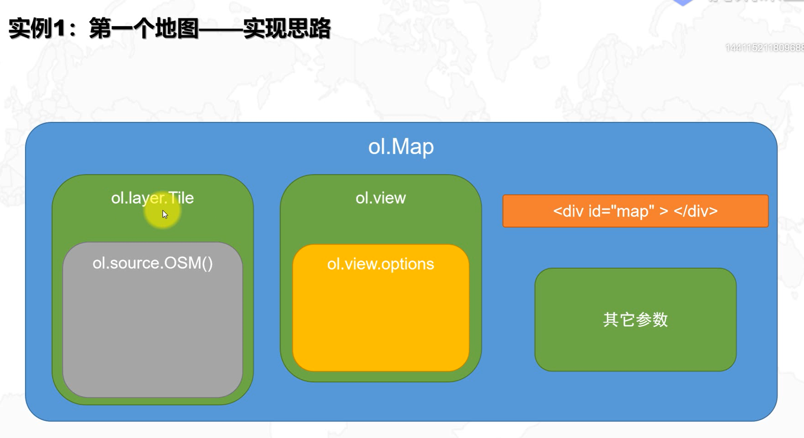

# openlayers-vue
**在vue项目中学习使用openlayers**
## Project setup
```
npm install
```
### Compiles and hot-reloads for development
```
npm run serve
```
### Compiles and minifies for production
```
npm run build
```
### Lints and fixes files
```
npm run lint
```
### Customize configuration
See [Configuration Reference](https://cli.vuejs.org/config/).

使用示例

##地图分类
- 瓦片地图
  > 瓦片地图就是将一整张底图按照一定的像素进行切分，比如按照256或者512进行切分的地图，这样主要是为了提高浏览效率，我们只访问视窗内的一些小瓦片即可，不用加载一整张地图，就是按需加载嘛，现在这些电子地图都是瓦片地图

- OSM
  > OpenStreetMap（简称OSM） 开源wiki地图，很多人们习以为常可以随便拿来用的地图，其实有很多法律和技术上的限制，这些限制使得像地图这类的地理资讯无法有创意、有效率地被再利用。开放街道地图成立动机在于希望能创造并且提供可以被自由地使用的地理资料（像街道地图）给每个想使用的人，就像自由软件所赋予使用者的自由一样。
        
  > OpenStreetMap（简称OSM）是一个网上地图协作计划，目标是创造一个内容自由且能让所有人编辑的世界地图。
    
  > OSM的地图由用户根据手持GPS设备、航空摄影照片、其他自由内容甚至单靠本地知识绘制。网站里的地图图像及矢量数据皆以Open Database License(ODbL)授权。
- Arcgis在线午夜蓝地图服务

